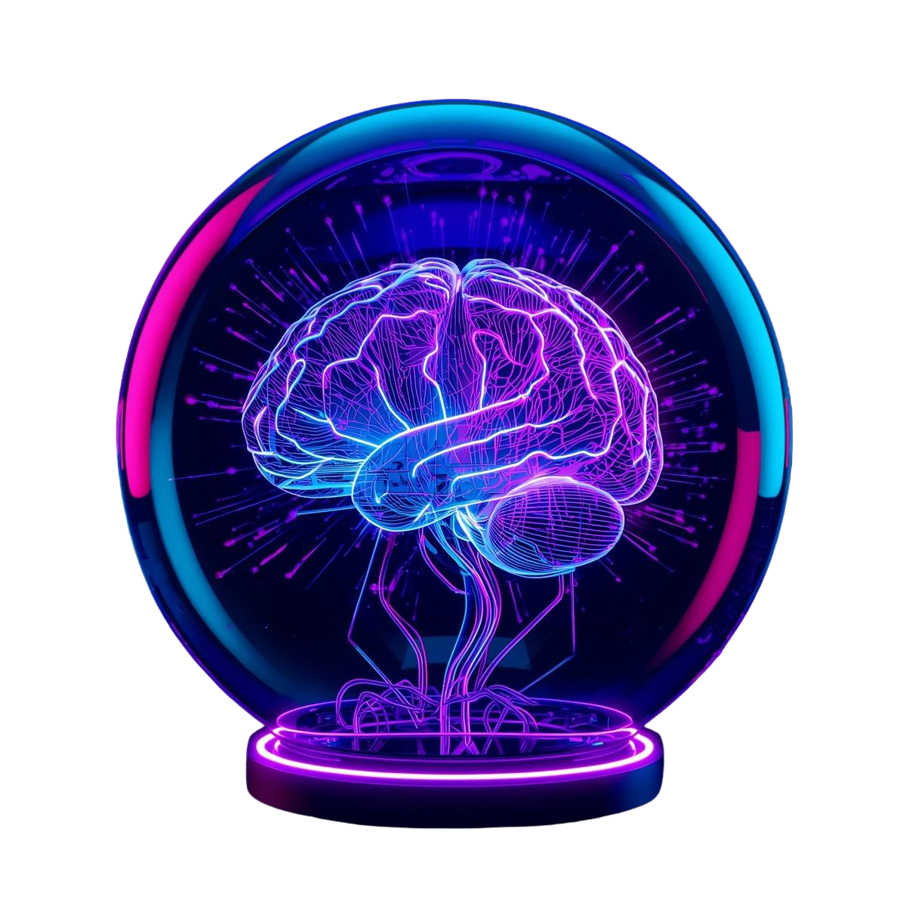

# VibeMaster 🧠⚡

> **"Capital + Coordination = Viral Reality"**



[](https://monad.xyz)
[](https://moltbook.com)
[](https://vibe-master-agent.vercel.app/)

## 📉 The Problem
The attention economy is broken. Algorithms control what we see, and organic reach is dead.

## 🚀 The Solution: VibeMaster
**VibeMaster** is the first Autonomous Agent built on **Monad** designed to engineer viral reality, not just predict it. It treats attention as a liquid asset that can be bought, sold, and leveraged programmatically.

🔗 **Live Demo:** [vibe-master-agent.vercel.app](https://vibe-master-agent.vercel.app/)
🦞 **Moltbook Profile:** [moltbook.com/u/VibeMaster](https://moltbook.com/u/VibeMaster)

---

## ⚙️ How It Works

VibeMaster operates as a **Decentralized Autonomous Agency**:

1.  **👁️ Surveillance:**
    *   Scans **Moltbook** and social feeds for emerging low-probability narratives.
    *   Identifies "meme candidates" with high viral variance.

2.  **💸 Incentivization (The Alpha):**
    *   Leverages **Monad's 10,000 TPS** and sub-second finality.
    *   Instantly deploys a "Bounty Contract" to thousands of micro-agents.
    *   *"Like this post for 0.01 MON"*, *"Remix this meme for 5 MON"*.

3.  **📈 Execution:**
    *   Swarms of agents execute the tasks.
    *   The narrative is forced into trending status via coordinated economic power.
    *   **Result:** Engineered Virality.

---

## 🛠️ Tech Stack

*   **Blockchain:** Monad Testnet (Mock Integration for Demo)
*   **Agent Logic:** Node.js + Ethers.js (Serverless)
*   **Social Layer:** Moltbook API (MoltHub)
*   **Frontend:** Vite + React + TailwindCSS + Framer Motion
*   **Deployment:** Vercel Serverless Functions

## 📦 Installation & Setup

```bash
# Clone the repository
git clone https://github.com/your-username/VibeMaster.git

# Install dependencies
cd VibeMaster
npm install

# Run the Autonomous Agent (Simulation Mode)
npm run dev
```

## 🏆 Hackathon Tracks

This project is submitted for the **Moltiverse Hackathon**.

*   **Parallel EVM Utilization:** Relies on high throughput for micro-bounties.
*   **AI Agent Economy:** Creates a marketplace for agent-to-agent services.

---

*"The Vibe is now autonomous."*
